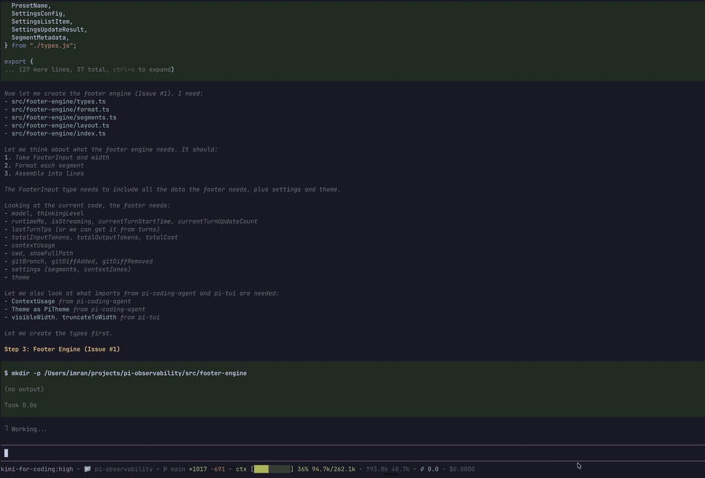
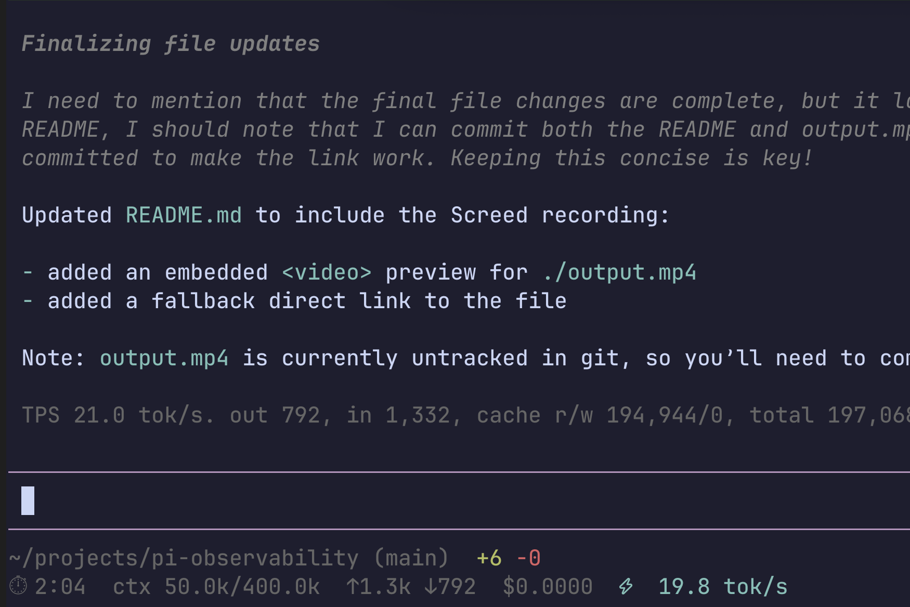

# 🔭 pi-observability

A [pi](https://github.com/mariozechner/pi) extension that replaces the default footer with a live observability bar and provides a full dashboard command.

## Features

- **Live footer bar** showing:
  - Session input/output tokens & estimated cost
  - Live TPS (tokens per second) during streaming
  - Session runtime
  - Current model & git branch
  - Git diff stats (added/removed lines)
  - Context usage (current / max)

- **`/obs` command** — Full-screen TUI dashboard with per-turn breakdowns and last 10 session history. Renders through pi's native TUI (no console spam), with theme-aware borders and dynamic terminal width.

- **`/obs-toggle` command** — Toggle the live footer on/off

## Preview

### Screed recording

> GitHub does not render inline MP4 players in `README.md`, so here's a short animated preview. Click it to open the full recording.

[](./output.mp4)

[Open the full screed recording (MP4)](./output.mp4)

### Footer

```
~/projects/my-app (main)  +42 -7
⏱ 12:34  ctx 4.2k/200k  ↑1.2k ↓3.4k  $0.0042  ⚡ 45.2 tok/s      claude-sonnet-4
```

### Git diff in the status bar



### Dashboard (`/obs`)

```
┌──────────────────────────────────────────┐
│ Agent Observability Dashboard            │
├──────────────────────────────────────────┤
│ Runtime: 12:34    Dir: ~/projects/my-app │
│ Branch: main    Model: claude-sonnet-4   │
├──────────────────────────────────────────┤
│ Tokens: ↑1.2k ↓3.4k                      │
│ Cost: $0.004200                          │
└──────────────────────────────────────────┘

  TURNS  (2)
  #   Input   Output   Time   TPS    Cost    Model
  ─────────────────────────────────────────────────
  1   ↑450    ↓1200    0:45   26.7   $0.00   claude-sonnet-4
  2   ↑320    ↓900     0:32   28.1   $0.00   claude-sonnet-4

  LAST 10 SESSIONS
  When                Duration   Turns   Input   Output   Cost
  ───────────────────────────────────────────────────────────
  Apr 18, 04:19 PM    9:05       10      ↑110k   ↓9.9k    $0.00
```

## Install

### Via npm

```bash
pi install npm:pi-observability
```

### Via git

```bash
pi install git:github.com/imran-vz/pi-observability
```

### Manual

Copy `extensions/observability.ts` to `~/.pi/agent/extensions/observability.ts` (or `.pi/extensions/observability.ts` for project-local).

## Commands

| Command | Description |
|---------|-------------|
| `/obs` | Open full observability dashboard in TUI overlay |
| `/obs-toggle` | Toggle the observability footer on/off |

## Requirements

- [pi](https://github.com/mariozechner/pi) coding agent
- Git (for branch & diff stats)

## License

MIT
